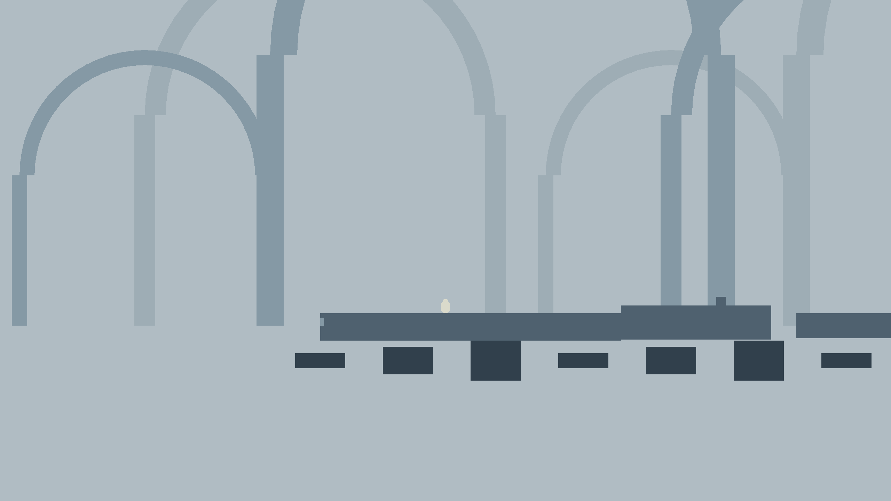
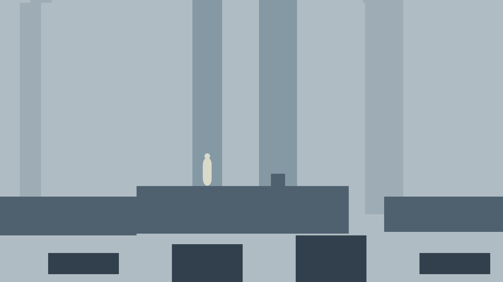
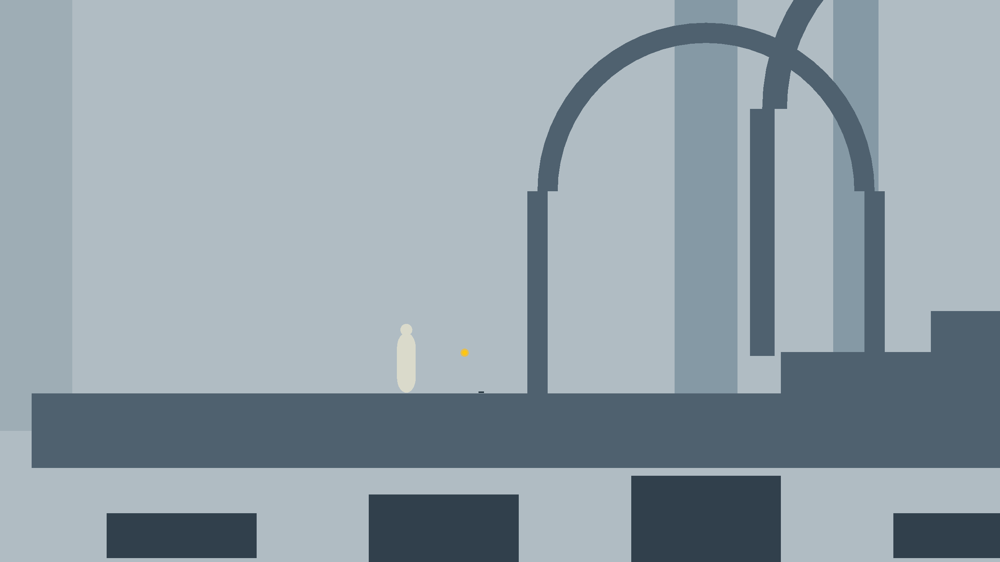
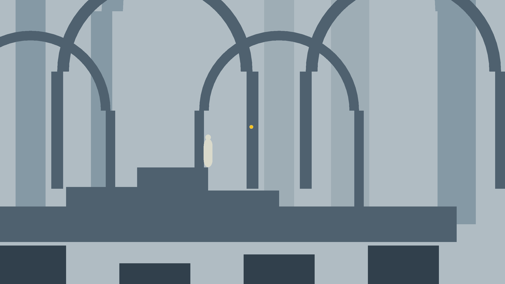

# Evidencia VS01 — 0:00–1:30

Capturas **reales de Game View**, 2560 × 1440, obtenidas en Play Mode mediante el test `StoryboardFramesAndFallRecovery`, tras posicionar al padre en cada checkpoint y dejar estabilizar la cámara. Los tiempos son etiquetas del storyboard, no el reloj de una partida continua.

## 0:00 — Despertar

## 0:30 — Primeros pasos

## 1:00 — Aparición de Hele

## 1:30 — Seguir a Hele

`camera_metrics.json`: muestra de cámara de 120 frames. `validation_results.json`: resultados individuales de Unity MCP. Véase `../../07_vertical_slice/vs01_implementation_0_90.md` para controles, alcance y limitaciones.
